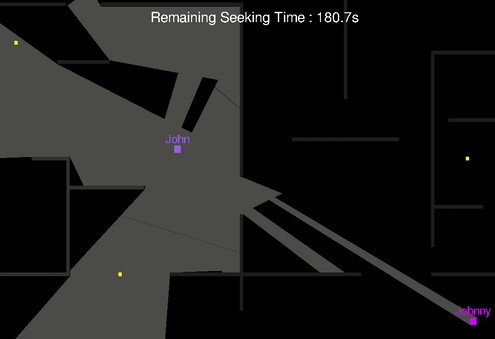

# Haunted Chronicles
A small project to discover online multiplayer games.

## Future Updates
- Improve the UDP connection (see issue #47).
- Add better graphics, such as a manor environment and ghosts and hunters skins for players.
- Launch the game on the ISCSC remote server (see issue #48).

## GAME :

Here is how it looks like:

### Python Module Dependencies
- pygame
- shapely

### Launch 

#### Server Launch
`python3 server.py` or `make server`

##### Client
`python3 client.py <Server_IP> <Server_Port>` or `make client SERVER=<Server_IP> PORT=<Server_Port>`

### Formatted messages :

#### Main messages :
##### Client connection :
* sends `CONNECT <Username> END` and receives `CONNECTED <Username> <Screen_Size> WALLS <Walls_List> STATE <Players_List> END` as a connection confirmation and to setup the state of the game locally.
##### Client inputs :
* sends `INPUT <Username> <Input> END` and receives `STATE <Players_List> END` to update the state of the game on the server, and then locally.
`<Input>` can be `LEFT`, `RIGHT`, `UP`, `DOWN` for movements ; `RED`, `BLUE`, `ǸEUTRAL` for teams ; `READY` to set player ready for game start ; and `.` for none.
##### Client disconnection :
* sends `DISCONNECT <Username> END` and receives `DISCONNECTED <Username> END` as a confirmation before quitting the game.

#### Others :
* Client sends periodically `PING <clock_time> END` and receives the same message to estimate the ping with the server.
* When the game has started, the ̀`STATE <Player_List>` becomes `STATE <Player_List> SHADES <Shades_List>` to communicate to each client the things they can see or not.
* To recognize if the game is currently played or if players are in the lobby, the server sends `LOBBY <Ready_Players_List> END` if the server is in a LOBBY state, which allow clients to display players which are ready to launch the game. It sends `GAME <Time> END` if the server is ingame, `<Time>` being the remaining time for seekers to hunt.
* To identify transition states, the server sends either `TRANSITION_GAME_LOBBY <Message> END` or `TRANSITION_LOBBY_GAME <Message> END` to respectively inform clients the server is in a transition state from GAME to LOBBY, or LOBBY to GAME, `<Message>` being the text to display on clients screens : such as the remaining time before the switch and the team that has won the game.
